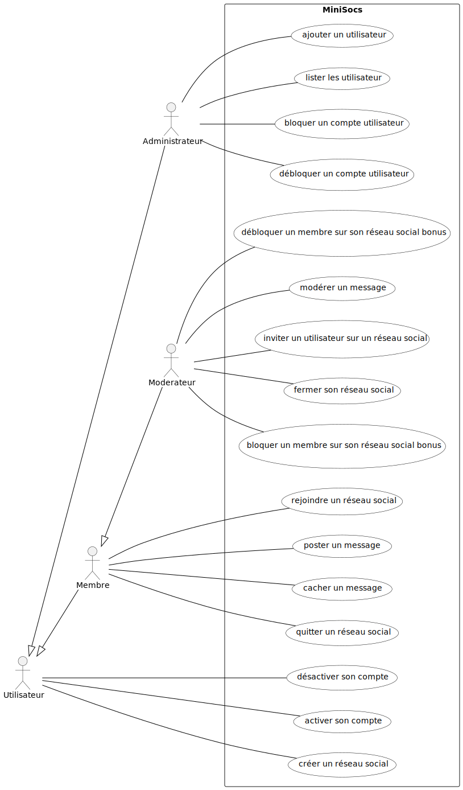
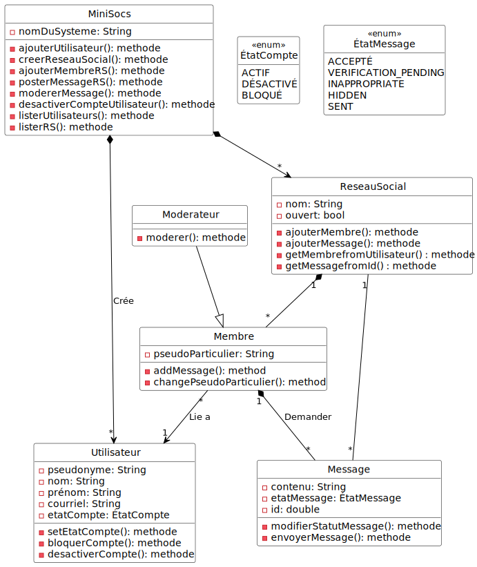
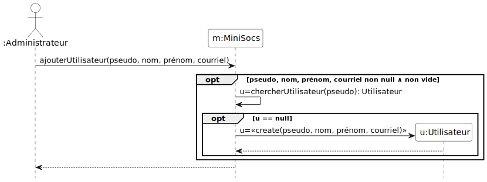

# Gestion de mini réseaux sociaux MiniSocs

Binôme :
* Luka LAFAYE DE MICHEAUX
* Alexandre CHIDIAC

## Syntaxe MarkDown

La syntaxe MarkDown de ce document est compatible avec la syntaxe
GitLab, qui est documentée dans
https://docs.gitlab.com/ee/user/markdown.html

## 1. Spécification

### 1.1. Acteurs et cas d'utilisation

La **première étape** consiste à **bien comprendre le système** à
étudier. Dans le cadre de l'exercice, cela consiste à lire
attentivement l'énoncé. Cette lecture doit permettre de *délimiter les
contours du système* à réaliser. La méthode générale consiste à
retrouver les acteurs qui interagissent avec lui. Il est très
important de fixer des frontières au problème. Ensuite, nous
recherchons les fonctionnalités du système par la définition de ses
cas d'utilisation. Dans le cadre de ce module, il s'agit de rechercher
les principales fonctions attendues du système. Nous nous limitons aux
cas d'utilisation pour atteindre les premiers objectifs indiqués dans
le cahier des charges, en prenant en considération les simplifications
énoncées dans le cahier des charges.

Pour réaliser le diagramme de cas d'utilisation à partir de l'analyse
du texte :
* rechercher les acteurs, avec les potentielles relation de
  généralisation spécialisation,
* rechercher les fonctionnalités du système accessibles aux acteurs

Pour rappel, la documentation du langage pour écrire les diagrammes
UML avec PlantUML est disponible à l'adress suivante :
- (https://plantuml.com/fr/)

Voici ci-dessous le diagramme de cas d'utilisation avec les cas
d'utilisation les plus importants (code
[source](./Diagrammes/minisocs_uml_diag_cas_utilisation.pu)).



### 1.2. Priorités, préconditions et postconditions des cas d'utilisation

Les priorités des cas d'utilisation sont choisies avec les règles de
bon sens suivantes:

* pour retirer une entité du système, elle doit y être. La priorité de
l'ajout est donc supérieure ou égale à la priorité du retrait ;

* pour lister les entités d'un type donné, elles doivent y être. La
priorité de l'ajout est donc supérieure ou égale à la priorité du
listage ;

* il est *a priori* possible, c.-à-d. sans raison contraire, de
démontrer la mise en œuvre d'un sous-ensemble des fonctionnalités du
système, et plus particulièrement la prise en compte des principales
règles de gestion, sans les retraits ou les listages ;

* la possibilité de lister aide au déverminage de l'application
pendant les activités d'exécution des tests de validation.

Par conséquent, les cas d'utilisation d'ajout sont *a priori* de
priorité « HAUTE », ceux de listage de priorité « Moyenne», et ceux de
retrait de priorité « basse ».

Voici les précondition et postcondition des cas d'utilisation de
priorité HAUTE.

### Cas d'utilisation de l'administrateur

#### Ajouter un utilisateur (HAUTE)
- précondition : \
∧ pseudo de l'exécuteur bien formé  (non null ∧ non vide) \
∧ pseudo de l'exécuteur existe \
∧ pseudo de l'exécuteur est administrateur \ 
∧ pseudo bien formé (non null ∧ non vide) \
∧ nom bien formé  (non null ∧ non vide) \
∧ prénom bien formé  (non null ∧ non vide) \
∧ courriel bien formé (respectant le standard RFC822) \
∧ utilisateur avec ce pseudo inexistant
- postcondition : \
∧ utilisateur avec ce pseudo existant \
∧ le compte de l'utilisateur est actif

#### Lister les utilisateurs (moyenne)
- précondition : \
∧ pseudo de l'exécuteur bien formé  (non null ∧ non vide) \
∧ pseudo de l'exécuteur existe \
∧ pseudo de l'exécuteur est administrateur

- postcondition : \
∧ liste des utilisateurs affichée \

#### Bloquer un compte utilisateur (basse)
- précondition : \
∧ pseudo de l'exécuteur bien formé  (non null ∧ non vide) \
∧ pseudo de l'exécuteur existe \
∧ pseudo de l'exécuteur est administrateur
∧ pseudo bien formé (non null ∧ non vide) \
∧ utilisateur avec ce pseudo existe \
∧ utilisateur avec ce pseudo n'est pas déjà bloqué

- postcondition : \
∧ utilisateur avec ce pseudo est bloqué \

#### Retirer un compte utilisateur (basse)
- précondition : \
∧ pseudo de l'exécuteur bien formé (non null ∧ non vide) \
∧ pseudo de l'exécuteur existe \
∧ pseudo de l'exécuteur est administrateur
∧ pseudo bien formé (non null ∧ non vide) \
∧ utilisateur avec ce pseudo existe

- postcondition : \
∧ utilisateur avec ce pseudo inexistant \

### Cas d'utilisation de l'utilisateur

#### Désactiver son compte (moyenne)
- précondition : \
∧ pseudo de l'exécuteur bien formé (non null ∧ non vide) \
∧ pseudo de l'exécuteur existe \
∧ pseudo de l'exécuteur n'est pas administrateur \
∧ le compte n'est pas bloqué
∧ le compte est actif

- postcondition : le compte de l'exécuteur est désactivé

NB : l'opération est idempotente.

#### Activer son compte (moyenne)
- précondition : \
∧ pseudo de l'exécuteur bien formé (non null ∧ non vide) \
∧ pseudo de l'exécuteur existe \
∧ le compte n'est bloqué \
∧ le compte est désactivé

- postcondition : le compte de l'exécuteur est actif

#### Créer un réseau social (HAUTE)
- précondition : \
∧ pseudo de l'exécuteur bien formé (non null ∧ non vide) \
∧ pseudo de l'exécuteur existe \
∧ le compte n'est pas bloqué \
∧ le compte est actif \
∧ le nom du réseau social est bien formé (non null ∧ non vide) \
∧ le nom du réseau social est disponible

- postcondition : \
∧ le réseau social est créé \
∧ l'exécuteur est modérateur de ce réseau social

#### Rejoindre un réseau social (HAUTE)
- précondition : \
∧ pseudo de l'exécuteur bien formé (non null ∧ non vide) \
∧ pseudo de l'exécuteur existe \
∧ le compte n'est pas bloqué \
∧ le compte est actif \
∧ le réseau social existe \
∧ le compte n'est pas déjà dans le réseau social

- postcondition : \
∧ l'exécuteur est membre du réseau social

### Cas d'utilisation du modérateur

#### Modérer un message (HAUTE)
- précondition : \
∧ pseudo bien formé (non null ∧ non vide) \
∧ le réseau social existe \
∧ l'utilisateur est moderateur de ce reseau social \
∧ le message existe dans le réseau social 


- postcondition : \
∧ le message est modéré (caché, supprimé, ou marqué comme inapproprié)

#### Fermer un réseau social (moyenne)
- précondition : \
∧ pseudo bien formé (non null ∧ non vide) \
∧ le réseau social existe \
∧ l'utilisateur est moderateur de ce reseau social 

- postcondition : \
∧ le réseau social est fermé \
∧ plus aucun utilisateur ne peut accéder au réseau social

#### Bloquer un membre sur son réseau social (basse) BONUS
- précondition : \
∧ pseudo bien formé (non null ∧ non vide) \
∧ le réseau social existe \ 
∧ l'utilisateur est moderateur de ce reseau social \
∧ le membre existe dans le réseau social \
∧ le membre n'est pas déjà bloqué 

- postcondition : \
∧ le membre est bloqué et ne peut plus interagir dans le réseau social

#### Débloquer un membre sur son réseau social (basse) BONUS
- précondition : \
∧ pseudo bien formé (non null ∧ non vide) \
∧ le réseau social existe \ 
∧ l'utilisateur est moderateur de ce reseau social \
∧ le membre existe \
∧ le membre est actuellement bloqué dans le réseau social

- postcondition : \
∧ le membre est débloqué et peut de nouveau interagir dans le réseau social

### Cas d'utilisation du membre

#### Poster un message (HAUTE)
- précondition : \
∧ pseudo bien formé (non null ∧ non vide) \
∧ l'utilisateur est membre actif du réseau social \
∧ le contenu du message est bien formé (non null ∧ non vide)

- postcondition : \
∧ le message est publié dans le réseau social

#### Cacher un message (basse)
- précondition : \
∧ pseudo bien formé (non null ∧ non vide) \
∧ le membre est l'auteur du message \
∧ le message existe et est visible

- postcondition : \
∧ le message est caché et n'est plus visible aux membres du réseau social

#### Quitter un réseau social (basse)
- précondition : \
∧ pseudo bien formé (non null ∧ non vide) \
∧ l'utilisateur est membre du réseau social

- postcondition : \
∧ l'utilisateur n'est plus membre du réseau social


## 2. Préparation des tests de validation des cas d'utilisation

### Tests administrateur

#### Ajouter un utilisateur (HAUTE)

| Décision                                                | 1 | 2 | 3 | 4 | 5 | 6 | 7 | 8 | 9 |
|---------------------------------------------------------|---|---|---|---|---|---|---|---|---|
| Pseudo de l'exécuteur bien formé  (non null ∧ non vide) | F | T | T | T | T | T | T | T | T |
| Pseudo de l'exécuteur existe                            |   | F | T | T | T | T | T | T | T |
| Pseudo de l'exécuteur est administrateur                |   |   | F | T | T | T | T | T | T |
| Pseudo bien formé (non null ∧ non vide)                 |   |   |   | F | T | T | T | T | T |
| Nom bien formé (non null ∧ non vide)                    |   |   |   |   | F | T | T | T | T |
| Prénom bien formé (non null ∧ non vide)                 |   |   |   |   |   | F | T | T | T |
| Courriel bien formé (respectant le standard RFC822)     |   |   |   |   |   |   | F | T | T |
| Utilisateur avec ce pseudo inexistant                   |   |   |   |   |   |   |   | F | T |
|                                                         |   |   |   |   |   |   |   |   |   |
| Utilisateur avec ce pseudo existant                     | F | F | F | F | F | F | F | F | T |
| Le compte de l'utilisateur est actif                    | F | F | F | F | F | F | F | F | T |
|                                                         |   |   |   |   |   |   |   |   |   |
| nombre de tests dans le jeu de tests                    | 2 | 1 | 1 | 2 | 2 | 2 | 3 | 1 | 1 |


Le jeu de test 7 comporte trois tests : non null, non vide, et adresse
courriel bien formée. On aurait pu n'en faire qu'un en considérant la
bibliothèque de validation RFC822 vérifie les deux premières
conditions.

#### Lister les utilisateurs (moyenne)

| Décision                                                | 1 | 2 | 3 | 4 |
|---------------------------------------------------------|---|---|---|---|
| Pseudo de l'exécuteur bien formé  (non null ∧ non vide) | F | T | T | T |
| Pseudo de l'exécuteur existe                            |   | F | T | T |
| Pseudo de l'exécuteur est administrateur                |   |   | F | T |
|                                                         |   |   |   |   |
| Liste des utilisateurs affichée                         | F | F | F | T |
|                                                         |   |   |   |   |
| nombre de tests dans le jeu de tests                    | 2 | 1 | 1 | 1 |

#### Bloquer un compte utilisateur (basse)

| Décision                                                | 1 | 2 | 3 | 4 | 5 | 6 | 7 |
|---------------------------------------------------------|---|---|---|---|---|---|---|
| Pseudo de l'exécuteur bien formé  (non null ∧ non vide) | F | T | T | T | T | T | T |
| Pseudo de l'exécuteur existe                            |   | F | T | T | T | T | T |
| Pseudo de l'exécuteur est administrateur                |   |   | F | T | T | T | T |
| Pseudo bien formé (non null ∧ non vide)                 |   |   |   | F | T | T | T |
| Utilisateur avec ce pseudo existe                       |   |   |   |   | F | T | T |
| Utilisateur avec ce pseudo n'est pas déjà bloqué        |   |   |   |   |   | F | T |
|                                                         |   |   |   |   |   |   |   |
| Utilisateur avec ce pseudo est bloqué                   | F | F | F | F | F | F | T |
|                                                         |   |   |   |   |   |   |   |
| nombre de tests dans le jeu de tests                    | 2 | 1 | 1 | 2 | 1 | 1 | 1 |


#### Retirer un compte utilisateur (basse)

| Décision                                                | 1 | 2 | 3 | 4 | 5 | 6 |
|---------------------------------------------------------|---|---|---|---|---|---|
| Pseudo de l'exécuteur bien formé  (non null ∧ non vide) | F | T | T | T | T | T |
| Pseudo de l'exécuteur existe                            |   | F | T | T | T | T |
| Pseudo de l'exécuteur est administrateur                |   |   | F | T | T | T |
| Pseudo bien formé (non null ∧ non vide)                 |   |   |   | F | T | T |
| Utilisateur avec ce pseudo existe                       |   |   |   |   | F | T |
|                                                         |   |   |   |   |   |   |
| Utilisateur avec ce pseudo est bloqué                   | F | F | F | F | F | T |
|                                                         |   |   |   |   |   |   |
| nombre de tests dans le jeu de tests                    | 2 | 1 | 1 | 2 | 1 | 1 |

## Tests utilisateur

#### Désactiver son compte (moyenne)

| Décision                                                | 1 | 2 | 3 | 4 | 5 | 6 |
|---------------------------------------------------------|---|---|---|---|---|---|
| Pseudo de l'exécuteur bien formé  (non null ∧ non vide) | F | T | T | T | T | T |
| Pseudo de l'exécuteur existe                            |   | F | T | T | T | T |
| Pseudo de l'exécuteur n'est pas administrateur          |   |   | F | T | T | T |
| Le compte n'est pas bloqué                              |   |   |   | F | T | T |
| Le compte est actif                                     |   |   |   |   | F | T |
|                                                         |   |   |   |   |   |   |
| Le compte de l'exécuteur est désactivé                  | F | F | F | F | F | T |
|                                                         |   |   |   |   |   |   |
| nombre de tests dans le jeu de tests                    | 2 | 1 | 1 | 1 | 1 | 1 |

#### Activer son compte (moyenne)

| Décision                                                | 1 | 2 | 3 | 4 | 5 |
|---------------------------------------------------------|---|---|---|---|---|
| Pseudo de l'exécuteur bien formé  (non null ∧ non vide) | F | T | T | T | T |
| Pseudo de l'exécuteur existe                            |   | F | T | T | T |
| Le compte n'est pas bloqué                              |   |   | F | T | T |
| Le compte est désactivé                                 |   |   |   | F | T |
|                                                         |   |   |   |   |   |
| Le compte de l'exécuteur est actif                      | F | F | F | F | T |
|                                                         |   |   |   |   |   |
| nombre de tests dans le jeu de tests                    | 2 | 1 | 1 | 1 | 1 |

#### Créer un réseau social (HAUTE)

| Décision                                                      | 1 | 2 | 3 | 4 | 5 | 6 | 7 |
|---------------------------------------------------------------|---|---|---|---|---|---|---|
| Pseudo de l'exécuteur bien formé  (non null ∧ non vide)       | F | T | T | T | T | T | T |
| Pseudo de l'exécuteur existe                                  |   | F | T | T | T | T | T |
| Le compte n'est pas bloqué                                    |   |   | F | T | T | T | T |
| Le compte est actif                                           |   |   |   | F | T | T | T |
| Le nom du réseau social est bien formé  (non null ∧ non vide) |   |   |   |   | F | T | T |
| Le nom du réseau social est disponible                        |   |   |   |   |   | F | T |
|                                                               |   |   |   |   |   |   |   |
| Le réseau social est créé                                     | F | F | F | F | F | F | T |
| L'exécuteur est modérateur de ce réseau social                | F | F | F | F | F | F | T |
|                                                               |   |   |   |   |   |   |   |
| nombre de tests dans le jeu de tests                          | 2 | 1 | 1 | 1 | 2 | 1 | 1 |

#### Rejoindre un réseau social (HAUTE)

| Décision                                                      | 1 | 2 | 3 | 4 | 5 | 6 | 7 | 8 |
|---------------------------------------------------------------|---|---|---|---|---|---|---|---|
| Pseudo de l'exécuteur bien formé  (non null ∧ non vide)       | F | T | T | T | T | T | T | T |
| Pseudo de l'exécuteur existe                                  |   | F | T | T | T | T | T | T |
| Le compte n'est pas bloqué                                    |   |   | F | T | T | T | T | T |
| Le compte est actif                                           |   |   |   | F | T | T | T | T |
| Le nom du réseau social est bien formé  (non null ∧ non vide) |   |   |   |   | F | T | T | T |
| Le réseau social existe                                       |   |   |   |   |   | F | T | T |
| Le compte n'est pas déjà dans le réseau social                |   |   |   |   |   |   | F | T |
|                                                               |   |   |   |   |   |   |   |   |
| L'exécuteur est membre du réseau social                       | F | F | F | F | F | F | F | T |
|                                                               |   |   |   |   |   |   |   |   |
| nombre de tests dans le jeu de tests                          | 2 | 1 | 1 | 1 | 2 | 1 | 1 | 1 |

## Tests modérateurs

## Tests membres


# 3. Conception

## 3.1. Listes des classes candidates et de leurs attributs

Voici les listes des classes candidates et de leurs attributs:
- `MiniSocs` (mise en œuvre du patron de conception Façade) avec
  l'attribut `nom` pour le nom du système,
- `Utilisateur` avec les attributs `pseudo` pour identifier de manière
  unique un utilisateur, `nom` et `prénom`, adresse `courriel`, et
  `etatCompte` pour l'état de son compte,
- `ÉtatCompte` avec les énumérateurs `COMPTE_ACTIF` et `COMPTE_DÉSACTIVÉ`,

## 3.2. Premières opérations des classes

Les seules opérations que nous connaissons déjà sont celles
correspondant aux cas d'utilisation. Comme nous utilisons le patron de
conception Façade, toutes les opérations des cas d'utilisation sont
dans la Façade.

Donc, dans la classe `MiniSocs`, voici les premières opérations (en
ignorant celles de priorité « basse ») :
- `ajouterUtilisateur`,
- `désactiverCompte`,
- `bloquerCompte`,
- `listerUtilisateurs`.

## 3.3. Diagramme de classes

Le diagramme de classes obtenu lors d'une analyse à partir de l'énoncé
du problème est donné dans la figure qui suit. Dans ces diagrammes,
les opérations ne sont pas mentionnées parce qu'il y en aurait trop.

**Important: même dans les diagrammes de la conception détaillée, on
ne montre pas les attributs traduisant des associations.**

Pour rappel, la documentation du langage pour écrire les diagrammes
UML avec PlantUML est disponible à l'adress suivante :
- (https://plantuml.com/fr/)

Version sans les notifications
([source](./Diagrammes/minisocs_uml_diag_classes_sans_notif.pu)).


([source](./Diagrammes/minisocs_uml_diag_classes_sans_notif.pu))

## 3.4. Diagrammes de séquence

Dans la suite, plusieurs versions d'un même diagramme de séquence sont proposés :
- une version dite « recommandée » **avec** les barres d'activation,
- une version dite « simplifiée » **sans** les barres d'activation.

Pour rappel, la documentation du langage pour écrire les diagrammes
UML avec PlantUML est disponible à l'adress suivante :
- (https://plantuml.com/fr/)

#### Ajouter un utilisateur (HAUTE)

Version recommandée
([source](./Diagrammes/minisocs_uml_diag_seq_ajouter_utilisateur.pu)).


([source](./Diagrammes/minisocs_uml_diag_seq_ajouter_utilisateur.pu))

Version simplifiée
([source](./Diagrammes/minisocs_uml_diag_seq_ajouter_utilisateur_version_simplifiee.pu)).



([source](./Diagrammes/minisocs_uml_diag_seq_ajouter_utilisateur_version_simplifiee.pu))

# 7. Diagrammes de machine à états et invariants

Dans les diagrammes de machine à états, nous faisons le choix de faire
apparaître les états de création et de destruction. Ces états sont
transitoires, il est vrai, mais ils méritent cependant une attention
particulière.  L'état de création, en particulier, donne lieu, lors de
la réalisation dans un langage de programmation orienté objet, à
l'écriture d'une opération « constructeur » qui garantit que
tous les attributs sont initialisés correctement dès la création d'une
instance. Nous savons également qu'en Java la destruction se réalise
en « oubliant » l'objet : un mécanisme de ramasse
miettes détruit automatiquement les objets lorsqu'ils ne sont plus
référencés. Il n'en est pas de même dans tous les langages, et par
exemple en C++ qui ne possède pas de mécanisme de ramasse miettes, la
destruction des objets peut s'avérer un casse tête ardu.

Les actions provoquées par des appels en provenance d'autres objets
apparaissent sur les transitions. Nous avons gardé comme action
interne uniquement les actions correspondant à des appels que l'objet
fait seul ou fait de manière répétitive.  Les constructeurs et
destructeurs sont des exceptions (ils apparaissent en interne bien
qu'étant déclenchés par un autre objet).

## 7.1. Classe Utilisateur

### 7.1.1. Diagramme de machine à états

Diagramme ([source](./Diagrammes/minisocs_uml_diag_machine_a_etats_utilisateur.pu)).


([source](./Diagrammes/minisocs_uml_diag_machine_a_etats_utilisateur.pu))

### 7.1.2. Fiche de la classe

Voici tous les attributs de la classe :
```
— final String pseudonyme
— String nom
— String prenom
— String courriel
— EtatCompte etatCompte
```

### 7.1.3. Invariant

```
  pseudonyme != null ∧ !pseudonyme.isBlank()
∧ nom != null ∧ !nom.isBlank()
∧ prenom != null ∧ !prenom.isBlank()
∧ EmailValidator.getInstance().isValid(courriel)
∧ etatCompte != null
```

# 8 Préparation des tests unitaires

## 8.1. Opérations de la classe Utilisateur

### Opération constructeur

|                                              | 1   | 2   | 3   | 4   | 5   |
|:---------------------------------------------|:----|:----|:----|:----|:----|
| pseudonyme bien formé (non null ∧ non vide)  | F   | T   | T   | T   | T   |
| nom bien formé (non null ∧ non vide)         |     | F   | T   | T   | T   |
| prénom bien formé  (non null ∧ non vide)     |     |     | F   | T   | T   |
| courriel bien formé selon le standard RFC822 |     |     |     | F   | T   |
|                                              |     |     |     |     |     |
| pseudonyme' = pseudonyme                     | F   | F   | F   | F   | T   |
| nom' = nom                                   | F   | F   | F   | F   | T   |
| prénom' = prénom                             | F   | F   | F   | F   | T   |
| courriel' = courriel                         | F   | F   | F   | F   | T   |
| étatCompte' = actif                          | F   | F   | F   | F   | T   |
|                                              |     |     |     |     |     |
| levée d'un exception                         | oui | oui | oui | oui | non |
|                                              |     |     |     |     |     |
| nombre de tests dans le jeu de tests         | 2   | 2   | 2   | 3   | 1   |

Trois tests dans le jeu de tests 5 pour non null, puis non vide, et
enfin une chaîne de caractères qui n'est pas une adresse courriel.

### Opération désactiverCompte

|                                      | 1   | 2   |
|:-------------------------------------|:----|:----|
| étatCompte = actif                   | F   | T   |
|                                      |     |     |
| étatCompte' = désactivé              |     | T   |
|                                      |     |     |
| levée d'une exception                | oui | non |
|                                      |     |     |
| nombre de tests dans le jeu de tests | 1   | 2   |

Deux tests dans le jeu de tests 2 pour l'idempotence.

---
FIN DU DOCUMENT
